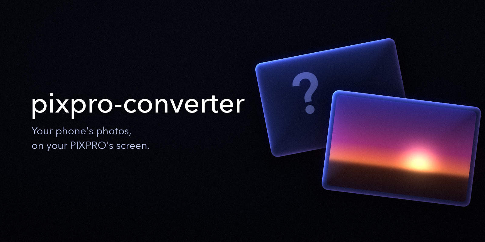

# pixpro-converter

**A macOS command-line tool that converts modern photos and videos into the format a Kodak PIXPRO FZ55 expects — so the pictures on your phone show up on the camera's own screen.**

Photos: working · Videos: working at 1280×720 / 30 fps · Tested on FZ55 firmware 1.06

> Unofficial project. Not affiliated with, endorsed by, or sponsored by Eastman Kodak Company or JK Imaging Ltd.

Copy a phone photo onto the camera's SD card and the camera ignores it or shows a `?`. Convert a video with ffmpeg and it plays in fast-forward while the sound runs at normal speed. The official manual just tells you not to try:

> "Do not store photos that are not taken using this camera in these folders as the pictures cannot be recognized during playback."
> — *KODAK PIXPRO FZ55 User Manual*

It turns out the camera *will* play your files — as long as every one of them looks exactly like something the camera wrote itself. pixpro-converter rebuilds each file to match what the FZ55 records. That means the JPEG tables its hardware decoder accepts, the separate preview files it actually draws the screen from, and the precise MOV layout its video player expects. None of this is documented anywhere we could find; it was worked out by taking real camera files apart byte by byte.

## What it does

- **Photos** (JPEG, PNG) → camera-style JPEG **plus the `.THM` preview file the camera actually displays**
- **Videos** (MP4, MOV, …) → Motion JPEG video with μ-law audio, packed in the camera's own MOV layout
- Keeps the original **capture date** so photos land on the right day in the camera's date view
- Uses the camera's **file naming and numbering**, so your files sit in the playback order you choose
- Copies to the SD card **without the hidden macOS files** (`._*`, `.DS_Store`) that can confuse the camera

## Compatibility

| | |
|---|---|
| Camera | Kodak PIXPRO **FZ55**, firmware **1.06**. Other PIXPRO models are untested. |
| Computer | **macOS only** (the copy step relies on `/Volumes`, `cp -X`, and `dot_clean`). |
| Photo input | JPEG, PNG. **iPhone HEIC photos need converting first** — see [Quick start](#4-convert). |
| Verified on the camera | Photos at 2048×1536 · videos at 1280×720 / 30 fps, made from a 1920×1080 / 30 fps reference video. |
| Not yet verified on the camera | 1920×1080 video output · 60 fps · references shot at other image sizes or video modes. |

Tested with ffmpeg 8.1, exiftool 13.55, and libjpeg-turbo 3.2 on macOS. Tried it on another PIXPRO model? Please open an issue and tell us how it went.

---

## Quick start — see one of your photos on the camera

**You need:** a Mac with [Homebrew](https://brew.sh), your FZ55, and its SD card with at least one photo **taken by the camera**. That photo becomes the reference the converter copies its settings from.

### 1. Install

```bash
git clone https://github.com/hyesungoh/pixpro-converter.git
cd pixpro-converter
brew install ffmpeg exiftool jpeg-turbo
```

`python3` ships with macOS. If it's missing, run `xcode-select --install`.

### 2. Find your card, then back it up

Put the SD card in your Mac.

```bash
ls /Volumes                           # find the card's name, e.g. "NO NAME"
CARD="/Volumes/NO NAME"               # keep the quotes: the name has a space
ls "$CARD/DCIM/100KFZ55" | tail -1    # last file on the card, e.g. 100_0120.JPG
```

The **next free number** is the last number plus one — `121` in this example. You'll pass it as `--start`.

> ⚠️ Copying to the card **overwrites any file with the same name, without asking**. Back up the card first:
> ```bash
> mkdir -p ~/fz55-backup && cp -R "$CARD/DCIM" "$CARD/SCN" ~/fz55-backup/
> ```

### 3. Create your reference files

The converter copies each new file's details from a real photo your camera took: its EXIF (camera model, shooting info, date), its naming, and its resolution. Those reference files aren't included in this repository. Copy one photo and its preview from your card, keeping the same folder layout:

```bash
ls "$CARD/DCIM/100KFZ55"/*.JPG | tail -1   # most recent photo, e.g. .../100_0120.JPG
mkdir -p ref/DCIM/100KFZ55 ref/SCN/100KFZ55
cp "$CARD/DCIM/100KFZ55/100_0120.JPG" ref/DCIM/100KFZ55/
cp "$CARD/SCN/100KFZ55/100_0120.THM"  ref/SCN/100KFZ55/
```

- Use your own file name in place of `100_0120`, and keep the name exactly as the camera wrote it.
- Your converted photos will have the **same image size as this reference**. Only 2048×1536 (the camera's 3M setting) has been tested on the camera. If your reference is bigger, add `--size 2048x1536` in step 4, or shoot a new reference at 3M.
- `--start` still counts from the card's **last** file, even if that's a video.

For videos you'll also need a reference video; see [Reference files](#reference-files-ref).

### 4. Convert

iPhone photos are usually HEIC, which the converter can't read yet. Convert them to JPEG first. This keeps the capture date:

```bash
sips -s format jpeg IMG_0001.HEIC --out IMG_0001.jpg
```

Then convert:

```bash
rm -rf out
./pixpro-convert.sh photo \
  --ref ref/DCIM/100KFZ55/100_0120.JPG \
  --out out --start 121 \
  ~/Pictures/beach.jpg ~/Pictures/cat.png
```

The files are numbered in the order you list them: `100_0121.JPG`, `100_0122.JPG`, …

The script's messages are in Korean. On success, each photo prints two lines, one ending in `DCIM/…JPG` and one ending in `SCN/…THM`. If you see a line starting with `경고:` ("warning"), or a photo has no `.THM` line, the converter didn't find your reference's preview. Those photos will show `?` on the camera. Recheck step 3.

### 5. Copy to the card and eject

```bash
./pixpro-convert.sh deploy out "$CARD"
diskutil eject "$CARD"
```

Write `out`, not `out/`. A trailing slash (which Tab completion adds) makes `deploy` fail.

### 6. Look at it on the camera

Put the card back in the camera and press the Playback button. Your photos come right after the camera's own shots.

---

## Reference files (`ref/`)

Every conversion needs a file the camera itself produced. The converter clones the camera's EXIF (maker, model, firmware, shooting info), file naming, and resolution from it. For video, it reuses the camera's exact MOV header.

```
ref/DCIM/100KFZ55/100_0120.JPG   a photo taken by the camera          (for photos)
ref/SCN/100KFZ55/100_0120.THM    its preview, same name               (for photos — required)
ref/DCIM/100KFZ55/100_0125.MOV   a short video recorded by the camera (for videos)
ref/SCN/100KFZ55/100_0125.THM    its preview                          (optional — not used)
```

Rules:

- **Keep the card's folder layout.** The converter finds the photo's preview by swapping `DCIM` for `SCN` in the path. If it can't find the `.THM`, it prints a warning and **carries on without one**. Those photos will show `?` on the camera.
- **Keep the camera's file names.** Numbering is derived from them (`100_0120` → prefix `100_`).
- **Reference photo:** take an ordinary, well-exposed shot at 2048×1536 (3M). Its ISO, shutter speed, and aperture are copied into every converted photo, so avoid a lens-cap shot.
- **Reference video:** record a 1–2 second clip at **1920×1080, 30 fps**. That's the combination verified on the camera; make smaller videos with `--size 1280x720` instead of recording a smaller reference. The converter assumes this mode's timing, so a reference recorded in another mode (such as 60 fps) may play at the wrong speed. The camera writes about 8.5 MB per second, so keep the clip short.
- **Copy the reference video with `cp` only.** Don't trim or re-save it with ffmpeg, QuickTime, Photos, or any editor, even with a "no re-encode" option. That rewrites the MOV header, and the header is exactly what the converter needs to copy. The converter detects and refuses a reference that ffmpeg has re-saved. Other editors may not be caught.
- Changed a camera setting (image size, video mode) or updated the firmware? Shoot new reference files.

## Converting photos

```bash
./pixpro-convert.sh photo --ref ref/DCIM/100KFZ55/100_0120.JPG --out out --start 121 PHOTOS...
```

- Output goes to `out/DCIM/100KFZ55/` and `out/SCN/100KFZ55/`, mirroring the card.
- Photos are resized to fit your reference photo's resolution. The aspect ratio is kept, and any empty space is filled with black bars.
- Capture date comes from the original's EXIF `DateTimeOriginal`, then `CreateDate`, then — if neither exists — the **file's modification time**. Photos saved from messaging apps often have no EXIF date. See [Troubleshooting](#troubleshooting).
- The reference's shooting details (ISO, shutter speed, aperture, maker/model) are copied into every converted photo. That's part of what makes the camera accept them, so the camera's info screen will show those values.

## Converting videos

```bash
./pixpro-convert.sh video \
  --ref ref/DCIM/100KFZ55/100_0125.MOV \
  --out out --start 130 --size 1280x720 \
  --date '2024:05:01 12:00:00' \
  VIDEOS...
```

- Use `--size 1280x720`. Without it, output matches the reference (1920×1080), which hasn't been verified on the camera yet.
- `--fps` defaults to 30. Other rates aren't verified on the camera. A 24 fps source is converted to 30 fps.
- `--date` sets the capture date. Without it, the original's date is used, and failing that, its modification time.
- Sources without audio get a silent audio track (the camera's own videos always have one).
- **Size:** Motion JPEG barely compresses. Expect roughly 75–120 MB per minute at 720p and about twice that at 1080p. The card's FAT32 file system caps each file at 4 GB.

## Command reference

```bash
./pixpro-convert.sh photo   --ref <JPG> --out <dir> [options] PHOTOS...
./pixpro-convert.sh video   --ref <MOV> --out <dir> [options] VIDEOS...
./pixpro-convert.sh deploy  <out dir> <card path>    # copy to the card, remove macOS junk files
./pixpro-convert.sh clean   <card path>              # remove macOS junk files only
./pixpro-convert.sh inspect FILES...                 # dump a file's structure and metadata
```

Running the script with no arguments prints the same usage in Korean.

| Option | Applies to | Description |
|---|---|---|
| `--ref <file>` | both | A file the camera produced, kept under `DCIM/100KFZ55/` with its original name. For photos, its `.THM` must be in `SCN/100KFZ55/`. Required. |
| `--out <dir>` | both | Output folder. Created with the card's `DCIM/` and `SCN/` layout. |
| `--start N` | both | First file number. Default: the reference's number + 1, which is only right when the reference is the last file on the card. Passing it explicitly is safer. |
| `--prefix S` | both | File name prefix. Default: taken from the reference (`100_`). |
| `--size WxH` | both | Output resolution. Default: the reference's. For photos, use a **4:3** size — the preview is always 640×480. |
| `--fps N` | video | 30 (default). |
| `--date 'YYYY:MM:DD HH:MM:SS'` | video | Capture date. Ignored for photos. |
| `--appn` | photo | Also copy two Kodak-specific data blocks from the reference. Tested and not needed. |

`deploy` only copies into folders that already exist on the card, and it only accepts paths under `/Volumes/`.

## Card layout and playback order

```
DCIM/100KFZ55/100_0121.JPG    the photo or video
SCN/100KFZ55/100_0121.THM     its preview — same name, different folder
```

- **The camera draws the screen from the `.THM` preview, not the JPG.** A photo whose preview is missing or malformed shows up in the list as `?`.
- Every photo and video needs its `.THM`. When you delete a file on the camera, its preview is deleted too. A preview with no matching file is ignored and safe to delete.
- **Playback follows file number order.** Changing a date doesn't move a file. Dates only matter for what's displayed and for the camera's date view.
- To **insert** photos between existing ones, rename files so the numbers follow the order you want. Always rename the file and its `.THM` together. Photos the camera took itself still play after renaming. There's no command for this yet, so do it by hand, or convert your photos in the order you want them.
- The camera numbers new shots after the higher of *the largest number on the card* and *the last number it used*. Deleting files doesn't make it reuse numbers, so renumbering your card won't collide with future shots.
- If you delete every file on the camera, it also removes its folders. Take one photo to recreate them, or create both yourself: `mkdir -p "$CARD/DCIM/100KFZ55" "$CARD/SCN/100KFZ55"` (that works too).

## Limitations

This is a young tool. Known rough edges:

- **HEIC photos fail** with a confusing ffmpeg error. Convert them first with `sips` (see [Quick start](#4-convert)), or set your iPhone to *Settings › Camera › Formats › Most Compatible*.
- **Numbers can collide.** The converter doesn't check whether a number is already taken — neither in `out/` nor on the card. If a photo and a video share a number, the video's preview replaces the photo's, and the photo shows `?`. Clear `out/` between runs (`rm -rf out`) and pick `--start` values that don't overlap.
- **`deploy out/` fails.** Pass the output folder without a trailing slash.
- **Photos ignore `--date`.** To fix a photo's date, write it into the original first (see Troubleshooting).
- **Photo `--size` must be 4:3.** The preview is always 640×480, so any other aspect ratio gets squashed on the camera screen.
- **A missing reference preview is only a warning** (`경고: …`). See [Reference files](#reference-files-ref).
- Script messages and code comments are currently in **Korean**. The ones you're likely to hit are translated in Troubleshooting.

## Troubleshooting

| Symptom | Cause | Fix |
|---|---|---|
| Photo appears as `?` | Its `.THM` preview is missing or wrong. | Check that `SCN/100KFZ55/<same name>.THM` exists on the card. When converting, `경고: 대응하는 THM 을 찾지 못했습니다` means "no matching THM found": put your reference's `.THM` in `ref/SCN/100KFZ55/`. Also check for number collisions. |
| Video picture fast-forwards, sound is normal | The MOV wasn't built from an untouched 1920×1080 / 30 fps camera reference. | Record a new reference in that mode, copy it from the card with `cp`, and convert again. |
| Photo shows today's date | The original has no EXIF date, so the file's modification time was used. | Write the date into the original, then convert again: `exiftool -DateTimeOriginal='2024:05:01 12:00:00' -CreateDate='2024:05:01 12:00:00' photo.jpg` (exiftool keeps a `photo.jpg_original` backup). |
| `Error opening output file …/enc.ppm` | HEIC input | Convert to JPEG with `sips` first. |
| `카드에 '…' 폴더가 없습니다` ("the folder … doesn't exist on the card") | If it names `out/…`: you typed `out/`. If it names `DCIM/100KFZ55` or `SCN/100KFZ55`: the camera removed the folders after its last file was deleted. If it names anything else (e.g. `DCIM/ref`): your reference isn't in the `DCIM/100KFZ55/` layout. | Use `out` without the slash / run `mkdir -p "$CARD/DCIM/100KFZ55" "$CARD/SCN/100KFZ55"` / redo step 3 of the Quick start. |
| `참조 파일명 … 이(가) DCF 형식 … 이 아닙니다` ("reference name isn't a camera file name") | The reference file was renamed. | Use the name the camera gave it, e.g. `100_0120.JPG`. Passing `--prefix`/`--start`, as the message suggests, doesn't help. |
| `템플릿이 카메라 원본이 아닙니다` ("template isn't a camera original") | The reference video was re-saved by ffmpeg. | Copy it again from the card with `cp`. |
| `… 이(가) 필요합니다. brew install …` ("… is required") | A dependency is missing. | Run the `brew install` shown. |

## How it works

Short version:

- **Photos:** encoded with libjpeg (`cjpeg`), because ffmpeg's JPEG encoder writes chroma subsampling in a form the camera's decoder rejects. The camera's EXIF is then cloned in, the JPEG segments are rearranged to match the camera byte for byte, and a matching 640×480 `.THM` preview is generated.
- **Videos:** frames are encoded as Motion JPEG and patched frame by frame. The MOV is then assembled by `pixpro-movmux.py`, which reuses the header from your reference video and only replaces sizes, offsets, and dates. ffmpeg's own MOV writer produces files the camera plays too fast.

The full reverse-engineering notes are in **[docs/TECHNICAL.md](docs/TECHNICAL.md)**: the exact JPEG and MOV structures, the pitfalls, and the experiments that isolated each cause.

| File | Role |
|---|---|
| `pixpro-convert.sh` | Entry point: `photo`, `video`, `deploy`, `clean`, `inspect` |
| `pixpro-jpegfix.py` | Rewrites JPEG segments to match the camera (single files and Motion JPEG streams) |
| `pixpro-movmux.py` | Builds the MOV container from the camera's own header |

## Sources

- [KODAK PIXPRO FZ55 User Manual (PDF, v04)](https://kodakpixpro.com/resources/cameras/friendly-zoom/fz55/docs/fz55-usermanual-en-v04.pdf)
- Everything else comes from analyzing files recorded by a real FZ55 (firmware 1.06).

## License

[MIT](LICENSE)

Kodak and PIXPRO are trademarks of their respective owners. They're used here only to describe which camera this tool works with.
